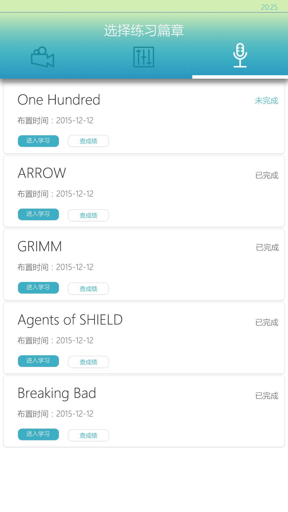
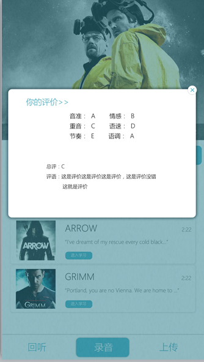
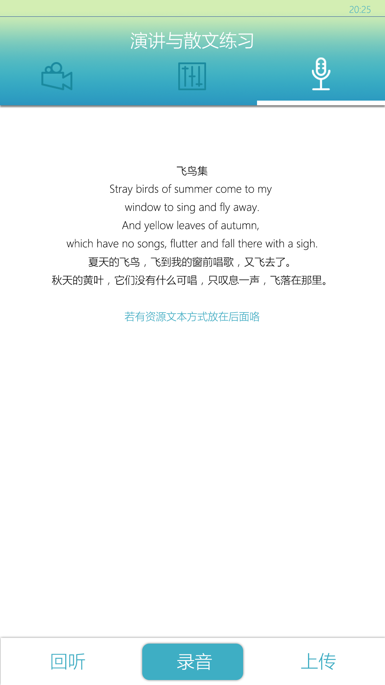

###i听说  
###英语语音口语学习android版
一个致力于让广外学生提高口语水平，老师提升口语教学质量的平台，i听说。项目包含三大模块，口语练习模块，教师管理模块和用户数据模块。这里是手机学生客户端的android源码。  
该录音系统于学校英教学院合作，共有320名学生，5名教师参与录制。训练语音由320名学生录制，语音语调包括10句句子，共3200条录音。情感语音包括4种情感，20句句子，共6400条语音。标准语音由2名教师录制，节奏语调包括10句句子，共20条录音，情感语音包括4种情感，20句句子，共40条语音。  
客户端的功能主要有三种，电影配音，语音语调练习，文章朗诵练习。
视频框架采用vitamio  
[了解更多vitamio](http://blog.csdn.net/flamejack/article/details/50936632)  
使用Gson+volley+okHTTP网络通信架构，更好地应付多用户，多线程的访问流量。  
  
  
  
  
  
